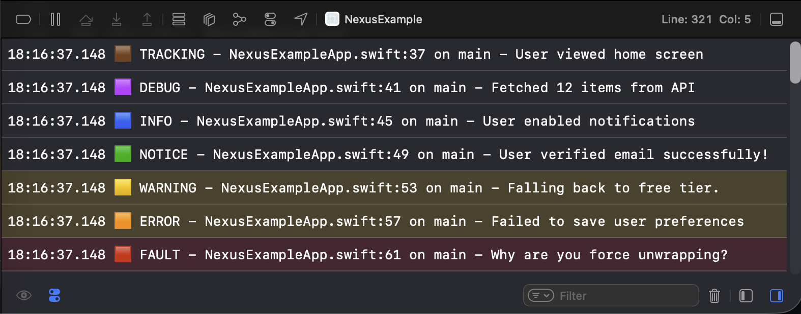

<p align="center">
  
</p>

<p align="center">
  
  
  
  
</p>

<p align="center">
  <em>A modern, concurrency-safe, fire-and-forget logging and tracking interface for all your Swift applications. Flexible input. Flexible output. Gorgeous developer experience.</em>
</p>


<p align="center">

</p>

## <br><br> What is Nexus?

Traditional logging and analytics setups in Swift apps are messy, inconsistent, and hard to scale. Teams often end up with:

* ❌ Dozens of `print` or `os_log` calls scattered across the codebase
* ❌ Analytics SDKs glued on without structure, separation, or thread-safety
* ❌ Tedious boilerplate to support different targets, platforms, or environments
* ❌ Difficult migrations when adding, removing, or switching logging and analytics services
* ❌ More time is spent on how to track, than what to track.
  
### <br> Nexus was built to solve these problems.

It’s a **modern, composable event router** that centralizes your app’s logs, analytics, and tracking through one unified API:

```swift
Nexus.track("User signed up", ["method": "email"])
```

## <br><br> Getting Started

### <br> 1. Installation

In Xcode: **File → Add Packages...**
Then enter repo URL:
   ```
   https://github.com/joshgallantt/Nexus.git
   ```
Finally, Add `Nexus` as a dependency to your target.

### <br> 2. Register Destinations

Destinations define **where** your events end up and **how** they get there. Register them early in your app lifecycle. More on them later..

#### <br> UIKit (AppDelegate)

```swift
import Nexus

func application(_ application: UIApplication,
                 didFinishLaunchingWithOptions launchOptions: ...) -> Bool {
    Nexus.addDestination(OSLoggerHumanReadable())
    return true
}
```

#### <br> SwiftUI (`@main`)

```swift
import Nexus
import SwiftUI

@main
struct MyApp: App {
    init() {
        Nexus.addDestination(OSLoggerHumanReadable())
    }

    var body: some Scene {
        WindowGroup {
            ContentView()
        }
    }
}
```

### <br> 3. Emit Events

```swift
Nexus.debug("User tapped login button")

Nexus.info("Screen appeared", ["screen": "HomeView"])

Nexus.track("User signed up", ["method": "email"])

Nexus.warning("Missing location permission")

Nexus.error("Network unreachable", ["retryCount": "2"])

Nexus.fault("Unexpected nil unwrapped!", ["file": "LoginManager.swift"])
```

## <br><br> Features:

**🥇 Single Call Site:** Send all events from a single API.

**🔌 Pluggable & Scalable Destinations:** Add, remove, modify, or replace backends with zero disruption.

**🧵 Thread-Safe by Design:** Fire-and-forget logging and analytics with the latest Swift Concurrency support.

**⚙️ Infinitely Flexible:** Filter events by metadata, `routingKey`, or event type to control delivery.

**🚫 No Dependencies:** Nexus is lightweight and vendor-agnostic — no external dependencies.

**📦 Multiple Payloads:** Send Nexus Events for key value pairs, any encodable object, or JSON.

Whether you're debug logging to the console in dev, sending analytics to Firebase in prod, or writing logs to disk in CI — Nexus is for you.


## <br><br> Optional Payloads

Nexus supports **three styles of payloads** for maximum flexibility depending on your needs:

### <br> 1. `Dictionary<String, Any?>`

Use this when:

* You have simple, flat key-value data
* You don’t need to encode nested types or complex structures

```swift
Nexus.info("User tapped login", ["screen": "LoginView", "button": "submit"])
```

Example output using one of our provided destinations:


### <br> 2. `Encodable` Types

Use this when:

* You want to send structured or nested data
* You want Swift type-safety and compiler assistance
* You prefer working with models or nested models instead of raw dictionaries
* If encoding fails, Nexus will fall back and emit an error message with the reason embedded in the event.

```swift
struct LoginEvent: Codable {
    let screen: String
    let button: String
    let userID: String
}

Nexus.track("Login event", LoginEvent(screen: "LoginView", button: "submit", userID: "abc123"))
```

Example output using one of our provided destinations:


### <br> 3. Pre-encoded `Data` (JSON)

Use this when:

* You’re receiving payloads from another service or layer that already encoded it
* You want full control over the encoding
* You want to bypass `Encodable` or avoid model creation

```swift
let jsonData = try JSONSerialization.data(withJSONObject: ["screen": "LoginView"], options: [])
Nexus.debug("Manually encoded event", jsonData)
```

Example output using one of our provided destinations:


## <br><br> Destinations

A **NexusDestination** receives events from Nexus.
* They are a place where you can map, modify, and filter data before sending it to it's final destination.
* Add as many as you like, even multiple for the same endpoint if you want!
* The processing of events happen in parallel - so when one destination slows down, the rest won't become blocked.

### <br> Registering Destinations

The following configuration will route events to all three destinations safely.

```swift
Nexus.addDestination(OSLoggerHumanReadable())
Nexus.addDestination(FirebaseDestination(), serialised: false)
Nexus.addDestination(FileLogger("/logs/analytics.log"))

Nexus.track("User started onboarding", attributes: ["step": "1"])
```

## <br><br> Serialization Modes

```swift
Nexus.addDestination(FirebaseDestination(), serialised: false)
```

#### <br> `serialised: true` (default)

* Events delivered **in order**, one at a time
* Backed by an internal `actor`
* Great for:

  * Ordered session logs
  * Debugging
  * File or console logs

#### <br> `serialised: false`

* Events delivered **concurrently** via `Task.detached`
* Great for:

  * High-throughput analytics SDKs
  * Background logging

⚠️ Avoid setting serialisation to `false` if your destination is not thread safe. Examples include:
* Writing to a file without locking
* Appending to shared arrays or dictionaries
* Depending on global/static state

## <br><br> Built-In Destinations

Nexus ships with some production ready destinations out of the box so you can start logging immediately - no setup required.

| Destination                 | Description                                                           |
| --------------------------- | --------------------------------------------------------------------- |
| `OSLoggerHumanReadable()`   | Used in the example images above, logs to Apple’s unified logging system in a easy to read format |
| `OSLoggerMachineParsable()` | Logs structured data suitable for ingestion and automation            |


## <br><br> Creating a Custom Destination

Conform to `NexusDestination`:

```swift
public protocol NexusDestination: Sendable {
    func send(_ event: NexusEvent) async
}
```

Use `event.message`, `event.data`, and `event.metadata` to access all event details.

#### <br> Example: Firebase Destination

```swift
import FirebaseAnalytics
import Nexus

public struct FirebaseDestination: NexusDestination {
    public init() {}

    public func send(_ event: NexusEvent) async {
        guard event.routingKey == "firebase" else { return }

        var params = event.data ?? [:]
        let meta = event.metadata

        params["type"] = meta.type.name
        params["timestamp"] = ISO8601DateFormatter().string(from: meta.time)
        params["device"] = meta.deviceModel
        params["os"] = meta.osVersion
        params["appVersion"] = meta.appVersion
        params["thread"] = meta.threadName
        params["file"] = meta.fileName
        params["function"] = meta.functionName
        params["line"] = meta.lineNumber

        Analytics.logEvent(event.message, parameters: params)
    }
}
```

## <br><br> Filtering
By default, all events are sent to all NexusDestinations with rich metadata along with your payload, it's up to you how you handle them.

The parameter `routingKey` is provided specifically to filter on a per event basis:

```swift
Nexus.track("User ID loaded", routingKey: "firebase")
```

Then filter in your destination like so:

```swift
guard routingKey == "firebase" else { return }
```

Alternatively, NexusDestinations can also filter or do logic based on any other data as you see fit.

## <br> Feature Comparison

| Capability                             | Nexus | OSLog | Firebase | DIY     |
| -------------------------------------- | ----- | ----- | -------- | ------- |
| Multi-destination routing              | ✅     | ❌     | ❌        | 🔧      |
| Custom backend integration             | ✅     | ❌     | ❌        | ⚠️      |
| Thread-safe delivery (actor-based)     | ✅     | ❌     | ❌        | ❌       |
| Handles logs *and* analytics           | ✅     | ❌     | ✅        | ⚠️      |
| Works across iOS, macOS, watchOS, tvOS | ✅     | ✅     | ✅        | Depends |
| Fire-and-forget API                    | ✅     | ❌     | ⚠️        | ❌       |
| Destination filtering                  | ✅     | ❌     | ❌        | ❌       |

## <br><br> Documentation

* Full API reference: *Coming soon*
* Example app: [`NexusExampleApp.swift`](./NexusExampleApp.swift)

## <br> Contributing

We welcome contributions, feature suggestions, and bug reports.

* Target Swift 5.9+
* Prefer actor-based, concurrency-safe implementations
* Include tests for new features

## <br> License

MIT – see [`LICENSE`](./LICENSE)

## <br> Questions or Feedback?

Open an issue or join a discussion!

<br>

Made with ❤️ by Josh Gallant
