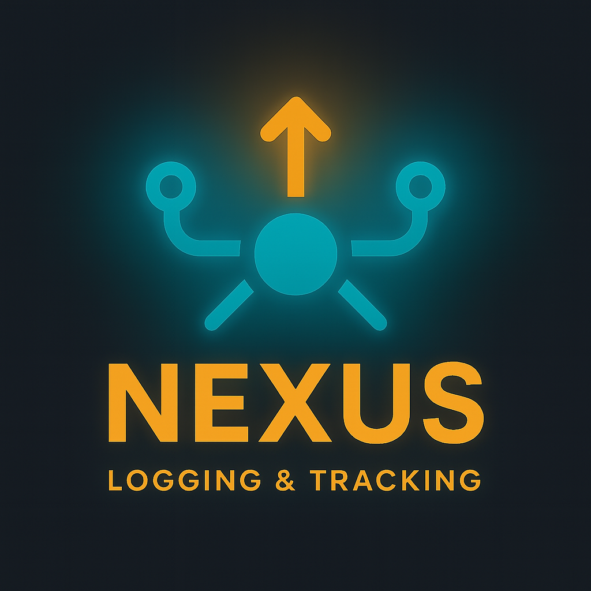
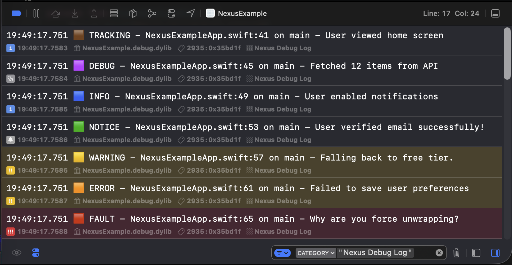
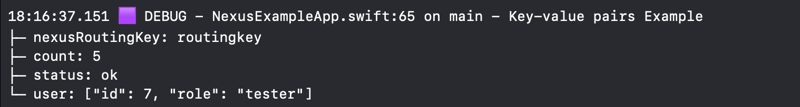
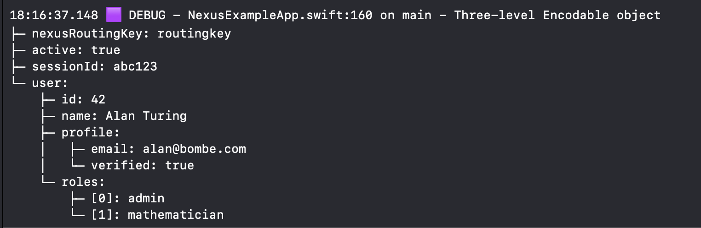
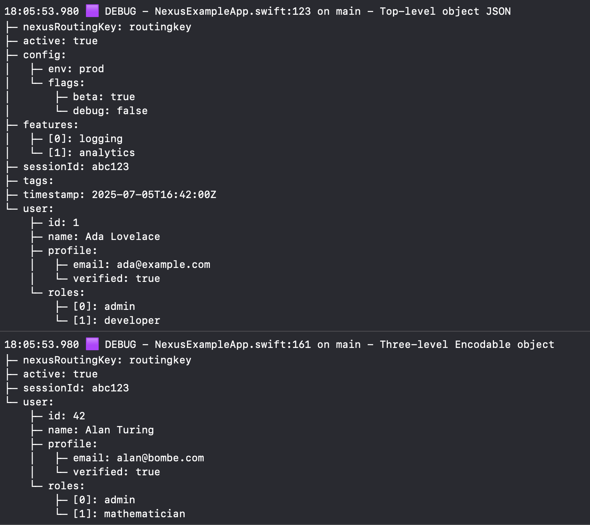

<div align="center">



<br><br>

[](#requirements)  
[](https://swift.org)
[](https://swift.org/package-manager/)
[](#)
[](./LICENSE)

<br>



<br><br>

<em>A modern, concurrency-safe, fire-and-forget logging and tracking interface for all your Swift applications. Flexible input. Flexible output. Excellent developer experience.</em>

</div>

## <br><br> What is Nexus?

Traditional logging and analytics setups in Swift apps are messy, inconsistent, and hard to scale. Teams often end up with:

* ❌ Dozens of `print` or `os_log` calls scattered across the codebase
* ❌ Analytics SDKs glued on without structure, separation, or thread-safety
* ❌ Difficult migrations when adding, removing, or switching logging and analytics services
* ❌ More time is spent on how to track, than what to track.
  
### <br> Nexus was built to solve these problems.

It’s a **modern, composable event router** that centralizes your app’s logs, analytics, and tracking through one unified API:

```swift
Nexus.track("User signed up", ["method": "email"])
```

## <br><br> Getting Started

### <br> 1. Installation

In Xcode: **File → Add Packages...**
Then enter repo URL:
   ```
   https://github.com/joshgallantt/Nexus.git
   ```
Finally, Add `Nexus` as a dependency to your target.

### <br> 2. Register Destinations

Destinations define **where** your events end up and **how** they get there. Register them early in your app lifecycle. More on them later..

#### <br> UIKit (AppDelegate)

```swift
import Nexus

func application(_ application: UIApplication,
                 didFinishLaunchingWithOptions launchOptions: ...) -> Bool {
    Nexus.addDestination(FirebaseDestination())
    return true
}
```

#### <br> SwiftUI (`@main`)

```swift
import Nexus
import SwiftUI

@main
struct MyApp: App {
    init() {
        Nexus.addDestination(FirebaseDestination())
    }

    var body: some Scene {
        WindowGroup {
            ContentView()
        }
    }
}
```

### <br> 3. Emit Events

```swift
Nexus.debug("User tapped login button")

Nexus.info("Screen appeared", ["screen": "HomeView"])

Nexus.track("User signed up", ["method": "email"])

Nexus.warning("Missing location permission")

Nexus.error("Network unreachable", ["retryCount": "2"])

Nexus.fault("Unexpected nil unwrapped!", ["file": "LoginManager.swift"])
```

## <br><br> Features:

**🏎️ Fast:** Events are processed in parallel. If one destination slows down, it won’t block the others. Each destination handles its own events and can be configured to process events concurrently, so even within a destination, slow events won’t block faster ones. Lastly, all processing happens on background threads, ensuring your UI remains smooth and responsive.

**🔌 Pluggable & Scalable Destinations:** A single set of API methods seperate you from the details. Add, remove, modify, or replace logging and tracking backends with zero disruption.

**🧵 Thread-Safe:** Destinations are kept safe inside an `actor` by default.

**⚙️ Infinitely Flexible:** Filter events by metadata, `routingKey`, or event type to control delivery.

**📦 Multiple Payload Options:** Send Nexus Events for key value pairs, any encodable object, or JSON.

**🍰 Rich:** Nexus Events generate rich contextual metadata ready for you to use.

**🚫 No Dependencies:** Nexus is lightweight and vendor-agnostic.

**🍎 Cross Platform:** Nexus works wherever Swift works— on-device, on the server, and in CI.  


Whether you're debug logging to the console in dev, sending analytics to Firebase in prod, or writing logs to disk in CI — Nexus is for you.


## <br><br> Optional Payloads

Nexus supports **three styles of payloads** for maximum flexibility depending on your needs:

### <br> 1. `Dictionary<String, Any?>`

Use this when:

* You have simple, flat key-value data
* You don’t need to encode nested types or complex structures

```swift
Nexus.info("User tapped login", ["screen": "LoginView", "button": "submit"])
```

Example output using one of our provided destinations:



### <br> 2. `Encodable` Types

Use this when:

* You want to send structured or nested data
* You want Swift type-safety and compiler assistance
* You prefer working with models or nested models instead of raw dictionaries
* If encoding fails, Nexus will fall back and emit an error message with the reason embedded in the event.

```swift
struct LoginEvent: Codable {
    let screen: String
    let button: String
    let userID: String
}

Nexus.track("Login event", LoginEvent(screen: "LoginView", button: "submit", userID: "abc123"))
```

Example output using one of our provided destinations:



### <br> 3. Pre-encoded `Data` (JSON)

Use this when:

* You’re receiving payloads from another service or layer that already encoded it
* You want full control over the encoding
* You want to bypass `Encodable` or avoid model creation

```swift
let jsonData = try JSONSerialization.data(withJSONObject: ["screen": "LoginView"], options: [])
Nexus.debug("Manually encoded event", jsonData)
```

Example output using one of our provided destinations:



## <br><br> Destinations

A **NexusDestination** receives events from Nexus.
* They are a place where you can map, modify, and filter data before sending it to it's final destination.
* For example, in the images shown above we format the data then print them to console through OS.Logger.
* Add as many as destinations you like, even multiple for the same endpoint if you want!
* The processing of events happen in parallel - so when one destination slows down, the rest won't become blocked.

### <br> Registering Destinations

The following configuration will route events to all three destinations safely.

```swift
Nexus.addDestination(NexusDebugLog(), .serial)
Nexus.addDestination(FirebaseDestination(), .concurrent)
Nexus.addDestination(FileLogger("/logs/analytics.log"), .serial)

Nexus.track("User started onboarding", attributes: ["step": "1"])
```

## <br><br> Event Delivery Mode
Nexus supports two delivery modes for destinations: serial and concurrent.
Choose the mode that matches your destination’s requirements for safety, ordering, and performance.

```swift
// Thread-safe, high-throughput analytics destination
Nexus.addDestination(FirebaseDestination(), .concurrent)

// File logger (default: serial delivery)
Nexus.addDestination(FileLogger(), .serial)

```

#### <br>  `.serial (default)`
* Events are delivered one at a time, in the order they occur.
* Backed by an internal `Actor` for thread safety.
* Best for:
    * File loggers (e.g., FileLogger, OSLogger)
    * Console or UI logging
    * Writing to a database or local storage
    * Any destination that is not thread-safe or relies on event order
    
Use .serial if you are unsure. This is the safest and most compatible mode.


#### <br> `.concurrent`
* Events are delivered in parallel and may arrive out of order.
* Provides higher throughput and lower latency, ideal for high-traffic scenarios.
* No guarantee on order of delivery; events may be processed by your destination simultaneously.

* Best for:
    * Analytics SDKs (e.g., Firebase, Segment)
    * High-throughput remote/network loggers
    * Any destination that is fully thread-safe and order-independent

* ⚠️ Avoid `.concurrent` if your destination:
    * Writes to files, local storage, or the UI without synchronization
    * Appends to shared arrays, dictionaries, or other collections
    * Relies on global or static variables
    * Needs to guarantee event order
    
Using .concurrent in these situations can lead to race conditions, data corruption, or out-of-order logs.

## <br><br> Built-In Destinations

Nexus ships with some production ready destinations out of the box so you can start logging immediately - no setup required.

| Destination                 | Description                                                           |
| --------------------------- | --------------------------------------------------------------------- |
| `NexusDebugLog()`   | Used in the example images above, logs to Apple’s unified logging system in a easy to read format |
| `NexusMachineParsableLog()` | Logs structured data suitable for ingestion and automation            |


## <br><br> Creating a Custom Destination

Conform to `NexusDestination`:

```swift
public protocol NexusDestination: Sendable {
    func send(_ event: NexusEvent) async
}
```

Use `event.message`, `event.data`, and `event.metadata` to access all event details.

#### <br> Example: Firebase Destination

```swift
import FirebaseAnalytics
import Nexus

public struct FirebaseDestination: NexusDestination {
    public init() {}

    public func send(_ event: NexusEvent) async {
        guard event.routingKey == "firebase" else { return }

        var params = event.data ?? [:]
        let meta = event.metadata

        params["type"] = meta.type.name
        params["timestamp"] = ISO8601DateFormatter().string(from: meta.time)
        params["device"] = meta.deviceModel
        params["os"] = meta.osVersion
        params["appVersion"] = meta.appVersion
        params["thread"] = meta.threadName
        params["file"] = meta.fileName
        params["function"] = meta.functionName
        params["line"] = meta.lineNumber

        Analytics.logEvent(event.message, parameters: params)
    }
}
```

## <br><br> Filtering
By default, all events are sent to all NexusDestinations with rich metadata along with your payload, it's up to you how you handle them.

The parameter `routingKey` is provided specifically to filter on a per event basis:

```swift
Nexus.track("User ID loaded", routingKey: "firebase")
```

Then filter in your destination like so:

```swift
guard routingKey == "firebase" else { return }
```

Alternatively, NexusDestinations can also filter or do logic based on any other data as you see fit.

## <br><br> Testing Nexus

Nexus is designed for testability. Even though logging is routed through a singleton, you can always achieve code coverage and verify logging in your tests by swapping in a mock destination and clearing out real ones.

### <br> How to Test: Example

1. **Create a mock destination (this one is included)**

```swift
final class MockNexusDestination: NexusDestination {
    private(set) var events: [NexusEvent] = []
    var eventReceived: (() -> Void)?

    func send(_ event: NexusEvent) async {
        events.append(event)
        eventReceived?()
    }

    func clearEvents() {
        events.removeAll()
    }
}
```

2. **Set up and use expectations in your test**

```swift
import XCTest
import Nexus

final class MyViewModel {
    func doSomething() {
        Nexus.info("did something important")
    }
}

final class MyViewModelTests: XCTestCase {
    var mock: MockNexusDestination!

    override func setUp() async throws {
        await Nexus.removeAllDestinations()
        mock = MockNexusDestination()
        Nexus.addDestination(mock)
    }

    func test_givenMockDestination_whenDoSomething_thenInfoEventSent() async throws {
        // Given
        let viewModel = MyViewModel()
        let expectation = XCTestExpectation(description: "Event received")

        mock.eventReceived = {
            expectation.fulfill()
        }

        // When
        viewModel.doSomething()

        // Then
        await fulfillment(of: [expectation], timeout: 1.0)
        XCTAssertEqual(mock.events.count, 1)
        XCTAssertEqual(mock.events.first?.message, "did something important")
        XCTAssertEqual(mock.events.first?.metadata.type, .info)
    }
}
```

> **Note:**
> By using an `XCTestExpectation` and a callback in your mock, you guarantee your test waits until the log event is actually received, making your tests deterministic and safe on any machine or CI runner.

### <br> Resetting State

Don't forget to clear destinations in your test’s `setUp` or `tearDown` to avoid interference between tests.

## <br><br> Documentation

* Example app: [`NexusExampleApp.swift`](./NexusExampleApp.swift)

## <br> Contributing

We welcome contributions, feature suggestions, and bug reports.

* Target Swift 5.9+
* Prefer actor-based, concurrency-safe implementations
* Include tests for new features

## <br> License

MIT – see [`LICENSE`](./LICENSE)

## <br> Questions or Feedback?

Open an issue or join a discussion!

<br>

Made with ❤️ by Josh Gallant
