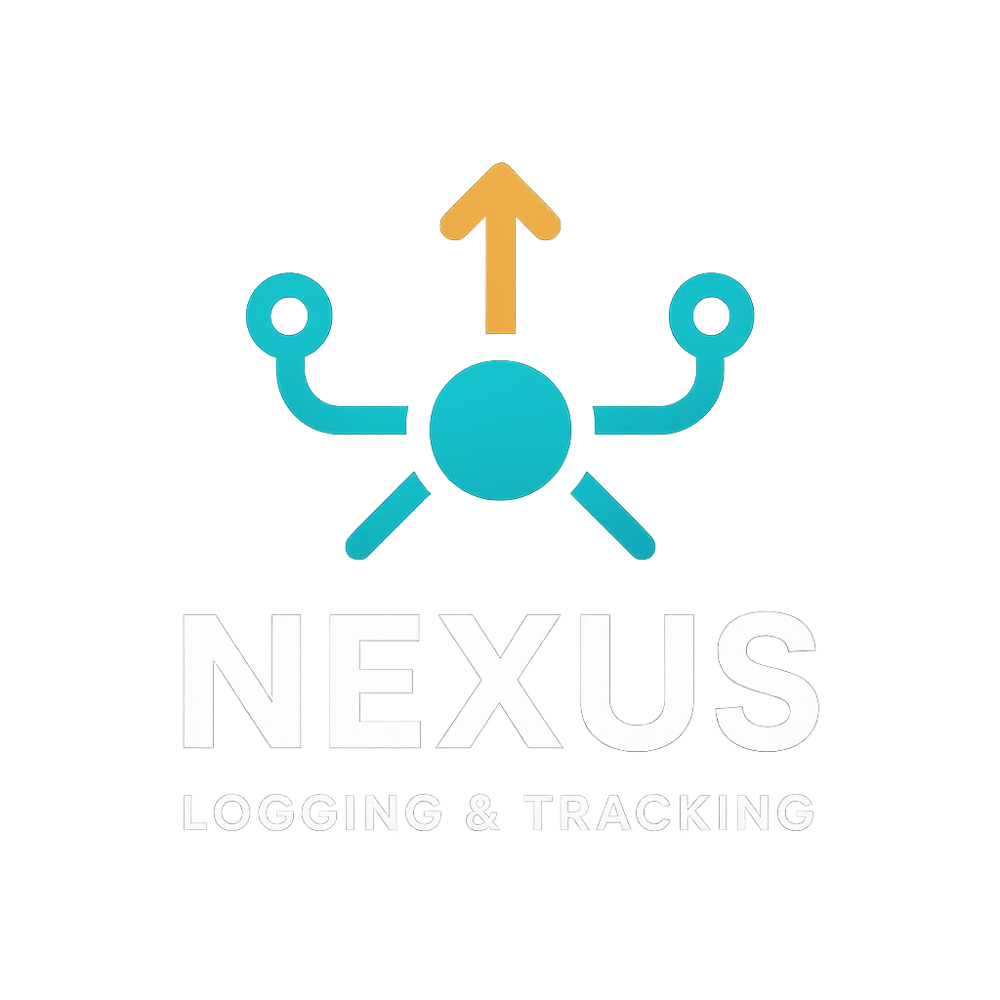
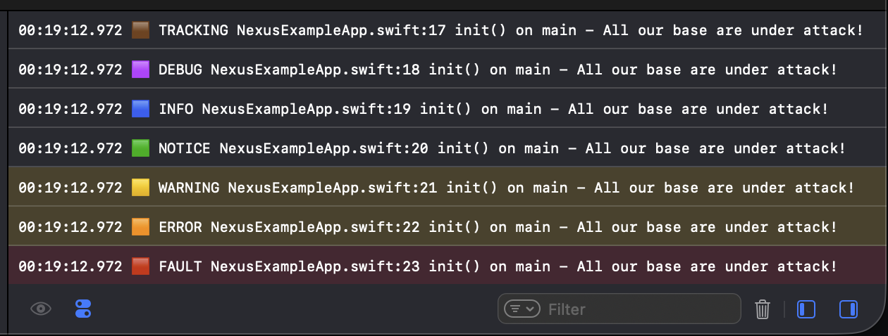

<p align="center">
  
</p>

<p align="center">
  
  
  
  
</p>

<p align="center">
  <em>A modern, concurrency-safe, fire-and-forget logging and tracking interface for all your Swift applications. Flexible input. Flexible output. Gorgeous developer experience.</em>
</p>


<p align="center"\>

</p>


## <br> 📦 Installation
### Swift Package Manager (Preferred)

1.  In Xcode: *File \> Add Packages...*
2.  Enter repo URL:
    ```
    https://github.com/joshgallantt/Nexus.git
    ```
3.  Add `Nexus` as a dependency to your target.


## <br> ✨ Quick Start

```swift
import Nexus

// Add a destination (e.g., console logger, analytics, etc.)
Nexus.addDestination(OSLoggerHumanReadable())

// Send different types of events
Nexus.debug("User tapped login button")
Nexus.info("Screen appeared", attributes: ["screen": "HomeView"])
Nexus.track("Signup Flow: Step 1 Start")
Nexus.warning("Missing location permission")
Nexus.error("Network unreachable", attributes: ["retryCount": "2"])
Nexus.fault("Unexpected nil unwrapped!", attributes: ["file": "LoginManager.swift"])
```

## <br> 🧠 Why Nexus?

Logging and analytics in Swift are fragmented, inconsistent, and often bolted on as an afterthought. Most teams end up with:

* 🧩 Dozens of `print` or `os_log` statements scattered across the codebase
* 🧪 Unstructured events tossed into multiple analytics platforms
* 🛠️ Painful process when adding or remove a new service (Firebase, Mparticle, Mixpanel, Sentry, etc.)
* 😵 Confusing or unsafe concurrency around logging

**Nexus** was built to fix all of that. It's your app's **central nervous system for events**, designed to:

* 💡 **Standardize how you log and track**
* 🧵 **Guarantee thread-safety and performance**
* 🎯 **Route logs/events flexibly** to multiple outputs
* 🧱 **Scale with your architecture** (from toy apps to massive multi-module clients)

## <br> 🧬 Design Philosophy

Nexus is built with these core tenets:

* **Composability** – define your event once, route it anywhere (console, analytics, files...)
* **Scalable architecture** – from side-projects to production apps, Nexus is designed to grow with your needs as requirements change. Add, swap, or remove destinations and logic without touching call sites.
* **First-class concurrency** – every part of Nexus is actor-based and thread-safe by default. Fire-and-forget, even from async contexts.
* **Unopinionated** – you choose what data to log and where it goes
* **No Dependancies** – ever.


## <br> ✨ What Makes Nexus Different?

While most logging tools focus on one job (e.g., logs to console), Nexus is built around **composable event routing**:

| Capability                             | Nexus | OSLog | Firebase | DIY     |
| -------------------------------------- | ----- | ----- | -------- | ------- |
| Multi-destination routing              | ✅     | ❌     | ❌        | 🔧      |
| Custom backend integration             | ✅     | ❌     | ❌        | ⚠️      |
| Thread-safe delivery (actor-based)     | ✅     | ❌     | ❌        | ❌       |
| Handles logs *and* analytics           | ✅     | ❌     | ✅        | ⚠️      |
| Works across iOS, macOS, watchOS, tvOS | ✅     | ✅     | ✅        | Depends |
| Fire-and-forget API                    | ✅     | ❌     | ⚠️       | ❌       |
| Destination filtering via routingKey   | ✅     | ❌     | ❌        | ❌       |

## <br> 🪄 Example Use Case: Firebase + Console + File

```swift
import Nexus

Nexus.addDestination(OSLoggerHumanReadable())
Nexus.addDestination(FirebaseDestination(), serialised: false)
Nexus.addDestination(FileLogger("/logs/analytics.log"))

Nexus.track("User started onboarding", attributes: ["step": "1"])
```

That’s it. Events are sent to all destinations concurrently and safely. No juggling SDKs or writing glue code. No threading bugs.

## 🧵 Event Serialization

When adding a destination using:

```swift
Nexus.addDestination(MyDestination(), serialised: true)
```

The `serialised` parameter controls **how events are delivered** to the destination.

### 🔒 `serialised: true` (default)

* Events are **delivered in order**, one at a time, using an **internal actor**.
* Use this mode when:

  * Event **sequencing matters** (e.g. session tracking, chain-dependent logging).
  * You're unsure if your destination is thread-safe.

### ⚡️ `serialised: false`

* Events are dispatched **concurrently** from **background tasks**:

  ```swift
  Task.detached(priority: .background) {
      await destination.send(...)
  }
  ```

* Ideal for:

  * High-throughput analytics SDKs
  * Logging where **order doesn't matter**
  * Any use case where **performance** is critical

### ✅ Benefits of `serialised: false`

* **Maximum throughput** — parallel event processing
* **Low latency** — no queuing or blocking
* **No ordering constraints**

### ⚠️ Your Responsibility (when `serialised: false`)

* `send(...)` may be called from **multiple threads simultaneously**
* You **must ensure thread safety** within your destination

> If your destination accesses shared state (e.g. writes to a file, array, or database), protect it using an `actor` or another form of synchronization (e.g. locks or `DispatchQueue`).

## <br> 🎯 Routing with routingKey
You can optionally route events to specific destinations by attaching a routingKey:

```swift
Nexus.track("User ID loaded", routingKey: "firebase")
```

Destinations can opt in to specific keys:

```swift
guard routingKey == "analytics" else { return }
```

This allows you to send certain events to Firebase, others to file loggers, and others to the console—all from the same call site.

>🧠 Note: routingKey is just a convention.
>Destinations can inspect and filter on any event metadata — such as type, attributes, fileName, or even threadName.
You’re in full control of how events are handled.

## <br> 🪐 Custom Destinations

Create your own by conforming to `NexusDestination`. Use as little or as much data as you'd like before sending it off to wherever you please\!

```swift
public protocol NexusDestination: Sendable {
    func send(
        type: NexusEventType,
        time: Date,
        deviceModel: String,
        osVersion: String,
        bundleName: String,
        appVersion: String,
        fileName: String,
        functionName: String,
        lineNumber: String,
        threadName: String,
        message: String,
        attributes: [String: String]?,
        routingKey: String?
    ) async
}
```

* You’ll receive detailed metadata.

* You can filter with routingKey or any data.

* All events are guaranteed to be delivered safely—either sequentially or concurrently depending on configuration.

## <br> Example Firebase Destination
```swift
import Foundation
import FirebaseAnalytics

public struct FirebaseDestination: NexusDestination {
    public init() {}

    public func send(
        type: NexusEventType,
        time: Date,
        deviceModel: String,
        osVersion: String,
        bundleName: String,
        appVersion: String,
        fileName: String,
        functionName: String,
        lineNumber: String,
        threadName: String,
        message: String,
        attributes: [String: String]? = nil,
        routingKey: String? = nil
    ) async {
        guard routingKey == "firebase" else { return }

        var params = attributes ?? [:]
        params["type"] = type.name
        params["timestamp"] = ISO8601DateFormatter().string(from: time)
        params["deviceModel"] = deviceModel
        params["osVersion"] = osVersion
        params["bundleName"] = bundleName
        params["appVersion"] = appVersion
        params["fileName"] = fileName
        params["functionName"] = functionName
        params["lineNumber"] = lineNumber
        params["threadName"] = threadName
        params["routingKey"] = routingKey
        params["message"] = message

        Analytics.logEvent(message, parameters: params)
    }
}
```


## <br> 📖 Documentation

  - Full API Reference: *Coming soon\!*
  - Example project included: see `NexusExampleApp.swift`


## <br> 🤝 Contributing

Contributions, bug reports, and feature requests are welcome\!

  - Open issues or pull requests.
  - Code should be Swift 5.9+ and covered by tests.


## <br> 📜 License

MIT License — see `LICENSE` file.

## <br> 💬 Questions, Comments, Concerns?

Open an issue or start a discussion\!

— Made with ❤️ by Josh Gallant
